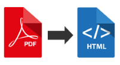
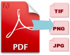
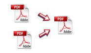

# PDF-Suite - a high level PHP wrapper over [PopplerPhp](https://github.com/ncjoes/poppler-php) 
#### PDF Suite extracts and converts the contents of PDF files to various formats, including HTML and SVG using Poppler utils








## Why Use PDF-Suite?

Many packages tagged as PDF converters are actually *->PDF converters, i.e from other formats to PDF.
PDF Suite, on the other hand, provides a high level of abstraction over the [PopplerPhp](https://github.com/ncjoes/poppler-php) package,
making it more easy to convert your PDF files into any of the formats supported by [Poppler utils](poppler.freedesktop.org).
These supported formats include:

*   HTML
*   JPG, PNG, TIFF
*   PostScript (PS)
*   Encapsulated PostScript (EPS)
*   Scalable Vector Graphic (SVG)
*   Plain Text

You can also use this package to split pdf files, combine pdf files, and detach embedded items from pdf files using PHP.

## How to Install?

You can install this package using any of these 2 methods:

* Install it via Composer (ncjoes/pdf-suite on Packagist);
* Use the official Git repository (https://github.com/ncjoes/pdf-suite).

Then, require the vendor/autoload.php file to enable the autoloading mechanism provided by Composer.
Otherwise, your application won't be able to find the classes of this Symfony component.

Finally, point the config settings to the location of Poppler utils binaries on your php server.
See [PopplerPhp](https://github.com/ncjoes/poppler-php) installation notes for help with Poppler Utils installation.

## How to Use?

Setup Poppler utils binaries location
```bash
NcJoes\PdfSuite\Config::setBinDirectory($dir);
```

Here are some examples.

```php
<?php
// if you are using composer, just use this
use NcJoes\PdfSuite\PdfSuite;
use NcJoes\PdfSuite\Config;

//Configuration
    Config::setBinDirectory(__DIR__.'/../vendor/bin/poppler');//set up poppler binaries location
    Config::setOutputDirectory(__DIR__.'/results', true); //set main output directory
    Config::doCleanupOnExit(false); //set to true if you want output files to be deleted on script termination


// Create PdfSuite instance
$file = dirname(__FILE__).'\sources\test1.pdf';
$pdfSuite = new PdfSuite($file);

//Pdf metadata
    $pdf_info = $pdfSuite->getPdfInfo(); //returns an associative array
    $authors = $pdf_info->getAuthors();
    $number_of_pages = $pdf_info->getNumOfPages();
    //...e.t.c.

//PDF to HTML converter
    $htmlConverter = $pdfSuite->getPdfToHtmlConverter();
    
    $htmlConverter->setPageRange(1, 16)->useDefaultSettings();
    $htmlConverter->setOutputSubDir('testSinglePageConverterOption');
    
    // returns a directory instance, a OOP model of a directory/folder containing the output files
    $directory = $htmlConverter->convert($htmlConverter::MODE_SINGLE_PAGE_PER_DOC);
    //other output mode options include
        //$converter::MODE_MULTI_PAGED_SINGLE_DOC
        //and
        //$converter::MODE_COMPLEX_DOCUMENT

//PDF to JPEG converter
    $jpegConverter = $pdfSuite->getPdfToJpegConverter();
    $jpegConverter->setPageRange(15, 33);
    $jpegConverter->convert(); // returns a directory instance

//PDF to PNG converter
    $pngConverter = $pdfSuite->getPdfToPngConverter();
    $pngConverter->setPageRange(15, 33);
    $pngConverter->convert(); // returns a directory instance

//PDF to PostScript converter
    $psConverter = $pdfSuite->getPdfToPsConverter();
    $psConverter->setPageRange(15, 33);
    $psConverter->convert(); // returns a directory instance

//PDF to SVG converter
    $svgConverter = $pdfSuite->getPdfToSvgConverter();
    $svgConverter->setPageRange(15, 33);
    $svgConverter->convert(); // returns a directory instance

//You can also obtain the underlying NcJoes\PopplerPhp\PopplerUtil instance
// and use it to further customize any of the converters
    $svgConverter = $pdfSuite->getPdfToSvgConverter();
    $svgConverterUtil = $svgConverter->util();
    $svgConverterUtil->utilOptions(); //returns an array of all available options for svgConverter
    $svgConverterUtil->setOption('key', 'value');
    //etc
?>
```

### License
The PDF Suite package is open-sourced software licensed under the [MIT license](http://opensource.org/licenses/MIT).

### Feedback & Contribute

Notify me of any issues, bugs, or improvements. Thanks :+1:
